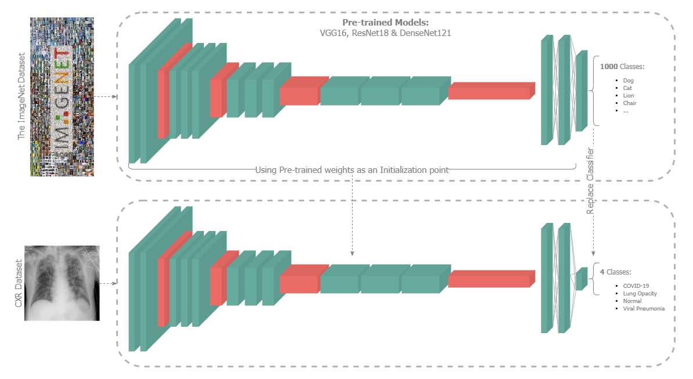
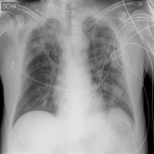
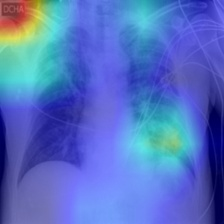
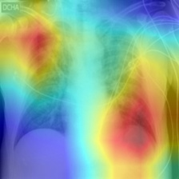
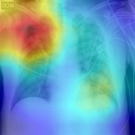

# Section 1: Classification and Gradient-based Localization of Chest Radiographs
{: .no_toc }

## Table of contents
{: .no_toc .text-delta }

1. TOC
{:toc}

---



## Introduction
> A team of radiologists from New Orleans studied the usefulness of Chest Radiographs for diagnosing COVID-19 compared to the reverse-transcription polymerase chain reaction (RT-PCR) and found out they could aid rapid diagnosis, especially in areas with limited testing facilities [[1]](https://pubs.rsna.org/doi/10.1148/ryct.2020200280 "A Characteristic Chest Radiographic Pattern in the Setting of the COVID-19 Pandemic").<br>
> Another study found out that the radiographs of different viral cases of pneumonia are comparative, and they overlap with other infectious and inflammatory lung diseases, making it hard for radiologists to recognize COVID‐19 from other viral pneumonia cases [[2]](https://pubs.rsna.org/doi/10.1148/rg.2018170048 "Radiographic and CT Features of Viral Pneumonia").<br>
> This project aims to make the former study a reality while dealing with the intricacies in the latter, with the help of Deep Learning.<br>

## Overview
> The project uses the COVID-19 Radiography Database [[3]](https://www.kaggle.com/tawsifurrahman/covid19-radiography-database) as it's dataset.
> It has a total of `21165` Chest X-Rays (CXRs) belonging to 4 different classes (`COVID-19`, `Lung Opacity`, `Normal` and `Viral Pneumonia`).<br>
> Three top scoring CNN architectures, __VGG-16__ [[4]](https://arxiv.org/abs/1409.1556 "Very Deep Convolutional Networks for Large-Scale Image Recognition"), __ResNet-18__ [[5]](https://arxiv.org/abs/1409.1556 "Deep Residual Learning for Image Recognition
") and __DenseNet-121__ [[6]](https://arxiv.org/abs/1608.06993 "Densely Connected Convolutional Networks"), trained on the ImageNet Dataset [[7]](http://image-net.org/), were chosen for __fine-tuning__ on the dataset.<br>
> The results obtained from the different architectures were then evaluted and compared.<br>
> Finally, with the help of __Gradient weighted Class Activation Maps__ (Grad-CAM) [[8]](https://arxiv.org/abs/1610.02391 "Grad-CAM: Visual Explanations from Deep Networks via Gradient-based Localization") the affected areas in CXRs were localized.<br>

* ___Note:___ The dataset and the trained models can be found in [here](https://drive.google.com/drive/folders/14L8wd-d2a3lvgqQtwV-y53Gsnn6Ud2-w?usp=sharing).<br>

## Steps
> 1. [Dataset Exploration](./1_data_exploration.ipynb "1_data_exploration.ipynb")
> 3. [Fine-tune VGG-16, ResNet-18 and DenseNet-121](./2_finetune_models.ipynb "2_finetune_models.ipynb")
>    1. [Define Transformations](./utils.py#L15-L33)
>    2. [Handle imbalanced dataset with Weighted Random Sampling (Over-sampling)](./2_finetune_models.ipynb "2_finetune_models.ipynb/<cell 3>")
>    3. [Prepare the Pre-trained models](./networks.py "networks.py")
>    4. [Fine-tune step with Early-stopping](./utils.py#L83-L151)
>       - |Hyper-parameters||
>         |:-|-:|
>         |Learning rate|`0.00003`|
>         |Batch Size|`32`|
>         |Number of Epochs|`25`|
>       - |Loss Function|Optimizer|
>         |:-:|:-:|
>         |`Categorical Cross Entropy`|`Adam`|
> 4. [Results Evaluation](./3_evaluate_results.ipynb "3_evaluate_results.ipynb")
>    1. [Plot confusion matrices](./plot_utils.py#L45-L69)
>    2. [Compute test-set Accuracy, Precision, Recall & F1-score](./utils.py#L64-L80)
>    3. [Localize using Grad-CAM](./grad_cam.py)
> 5. [Inference](./overlay_cam.py)

- __Localization with Gradient-based Class Activation Maps__
> |||||
> |:-:|:-:|:-:|:-:|
> |<sup>_COVID-19 infected CXR_</sup>|<sup>_VGG-16_</sup>|<sup>_ResNet-18_</sup>|<sup>_DenseNet-121_</sup>|

## Usage
> - Clone the repository
> ```bash
> git clone 'https://github.com/priyavrat-misra/xrays-and-gradcam.git' && cd xrays-and-gradcam/
> ```
> - Install dependencies
> ```bash
> pip install -r requirements.txt
> ```
> - Using `argparse` script for inference
> ```bash
> python overlay_cam.py --help
> ```

## Conclusions
> - DenseNet-121 having only `7.98 Million` parameters did relatively better than VGG-16 and ResNet-18, with `138 Million` and `11.17 Million` parameters respectively.
> - Increase in model's parameter count doesn’t necessarily achieve better results, but increase in residual connections might.
> - Oversampling helped in dealing with imbalanced data to a great extent.
> - Fine-tuning helped substantially by dealing with the comparatively small dataset and speeding up the training process.
> - GradCAM aided in localizing the areas in CXRs that decides a model's predictions.
> - The models did a good job distinguishing various infectious and inflammatory lung diseases, which is rather hard manually, as mentioned earlier.

## References
> - [1] David L. Smith, John-Paul Grenier, Catherine Batte, and Bradley Spieler. [A Characteristic Chest Radiographic Pattern in the Setting of the COVID-19 Pandemic](https://pubs.rsna.org/doi/10.1148/ryct.2020200280). Radiology: Cardiothoracic Imaging 2020 2:5.
> - [2] Hyun Jung Koo, Soyeoun Lim, Jooae Choe, Sang-Ho Choi, Heungsup Sung, and Kyung-Hyun Do. [Radiographic and CT Features of Viral Pneumonia](https://pubs.rsna.org/doi/10.1148/rg.2018170048). RadioGraphics 2018 38:3, 719-739.
> - [3] Tawsifur Rahman, Muhammad Chowdhury, Amith Khandakar. [COVID-19 Radiography Database](https://www.kaggle.com/tawsifurrahman/covid19-radiography-database). Kaggle.
> - [4] Karen Simonyan, Andrew Zisserman. [Very Deep Convolutional Networks for Large-Scale Image Recognition](https://arxiv.org/abs/1409.1556). arxiv:1409.1556v6.
> - [5] Kaiming He, Xiangyu Zhang, Shaoqing Ren, Jian Sun. [Deep Residual Learning for Image Recognition](https://arxiv.org/abs/1512.03385). arxiv:1512.03385v1.
> - [6] Gao Huang, Zhuang Liu, Laurens van der Maaten, Kilian Q. Weinberger. [Densely Connected Convolutional Networks](https://arxiv.org/abs/1608.06993). arxiv:1608.06993v5.
> - [7] Deng, J. et al., 2009. [Imagenet: A large-scale hierarchical image database. In 2009 IEEE conference on computer vision and pattern recognition](http://image-net.org/). pp. 248–255.
> - [8] Ramprasaath R. Selvaraju, Michael Cogswell, Abhishek Das, Ramakrishna Vedantam, Devi Parikh, Dhruv Batra. [Grad-CAM: Visual Explanations from Deep Networks via Gradient-based Localization](https://arxiv.org/abs/1610.02391). arXiv:1610.02391v4.